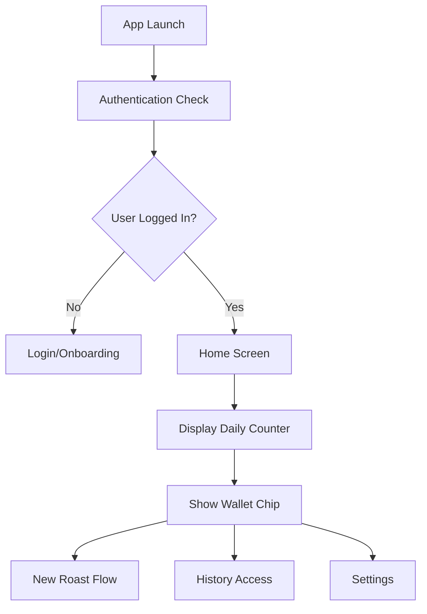
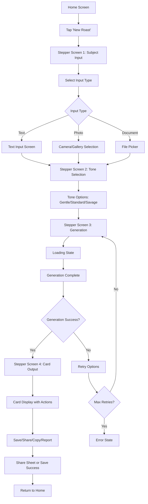
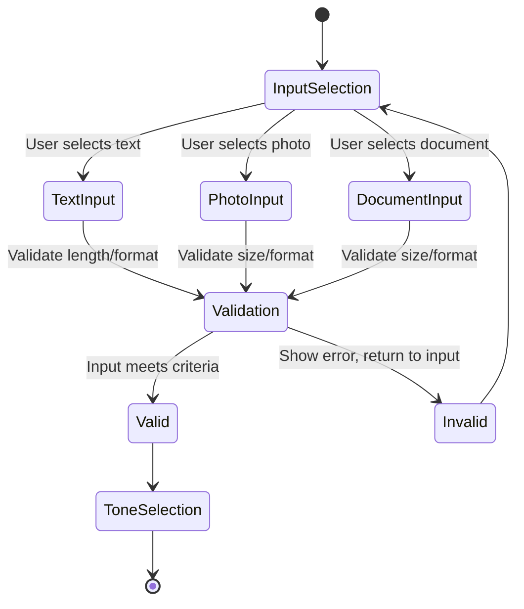
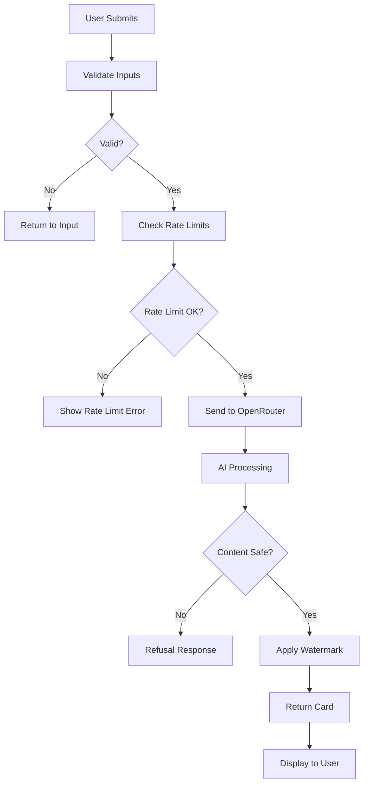
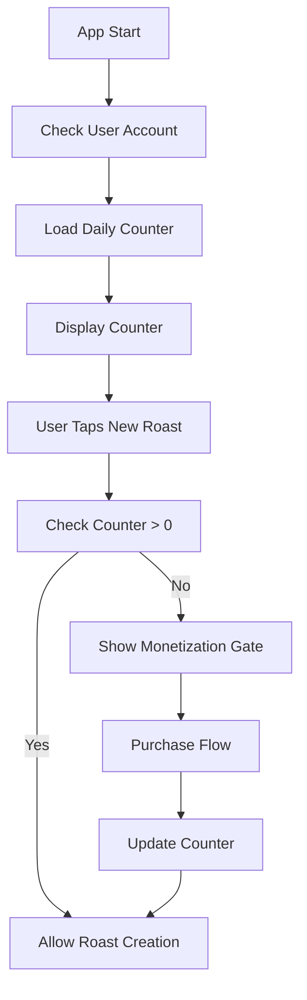
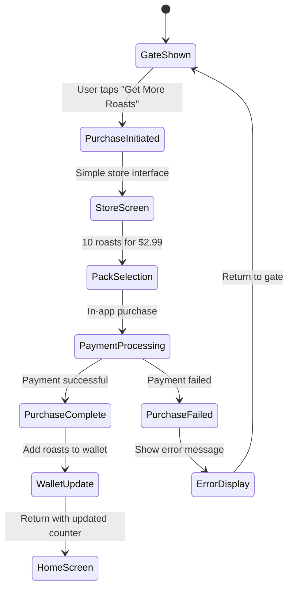
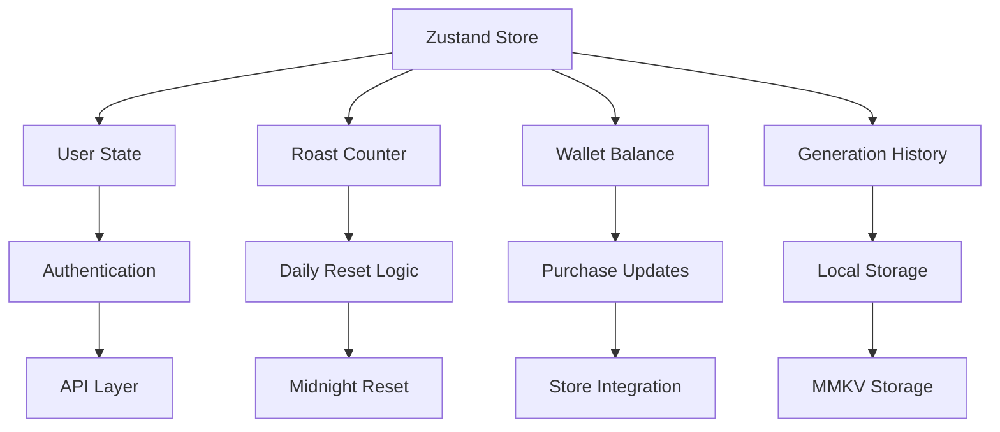
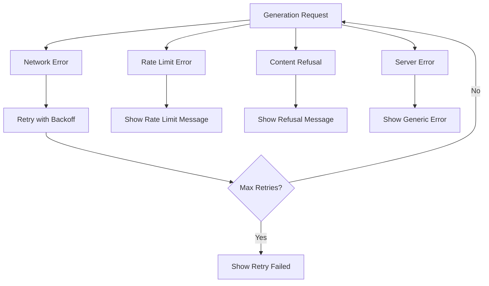
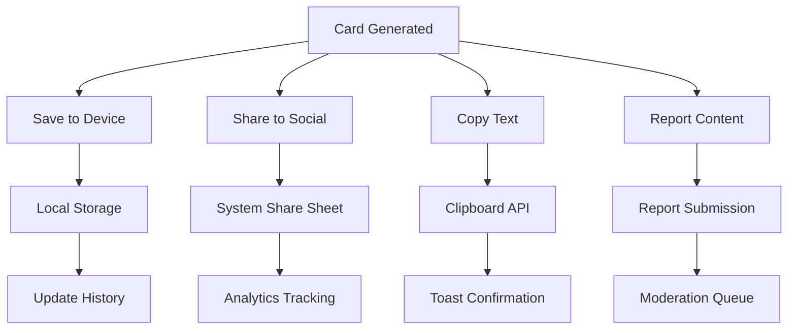
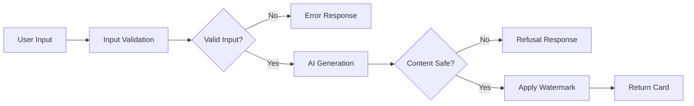

# Roast It - Application Flows

This document outlines the key user flows, technical flows, and business logic flows for the Roast It mobile application based on the Product Requirements Document.

## 1. User Journey Flow

### 1.1 Post-Login Experience

The post-login experience begins the moment a user launches the app and continues until they either create a new roast or navigate to other sections. This flow handles the critical transition from app launch to the main functionality.

**How it works:**

1. **App Launch**: When the user opens the app, it immediately checks if they're already authenticated
2. **Authentication Check**: The app queries the stored authentication state to determine if the user is logged in
3. **Routing Decision**: Based on authentication status, the user is either sent to login/onboarding or the main home screen
4. **Home Screen Setup**: Once on the home screen, the app loads and displays the user's current roast counter and wallet status
5. **Action Availability**: From the home screen, users can access the new roast flow, view history, or adjust settings

**Key Features:**

- Fast authentication check prevents unnecessary loading delays
- Seamless transition to home screen for returning users
- Clear visual indicators for available roasts and purchased credits
- Quick access to core functionality without navigation complexity

### 1.2 New Roast Flow (Primary User Flow)

The New Roast Flow is the core user journey that guides users through creating a roast card. This 4-step process is designed to be fast and intuitive while ensuring quality inputs and outputs.

**How it works:**

1. **Initiation**: User taps "New Roast" from the home screen, immediately entering the stepper interface
2. **Input Collection**: User selects their input type (text, photo, or document) and provides the subject matter
3. **Tone Selection**: User chooses the roast intensity (Gentle, Standard, or Savage) that matches their desired style
4. **Generation**: The app processes the inputs and generates the roast card
5. **Output Handling**: User receives the finished card with options to save, share, copy, or report

**Step Details:**

**Step 1 - Subject Input:**

- **Text**: Subject field for pasting target content with character limit enforcement
- **Photo**: Camera or gallery picker, followed by automatic text extraction
- **Document**: File picker for PDF, Markdown, or Word documents with text extraction
- **Validation**: Silent enforcement of size limits and instruction detection

**Step 2 - Tone Selection:**

- **Gentle**: Light-hearted, playful roasts
- **Standard**: Balanced humor with some edge
- **Savage**: Sharp, cutting roasts for maximum impact
- **Purpose**: Ensures consistent output style expectations

**Step 3 - Generation:**

- **Processing**: Inputs are sent to AI service with safety checks
- **Loading**: Clear progress indication with estimated wait time
- **Retries**: Up to 2 additional attempts if generation fails
- **Error Handling**: Graceful degradation with helpful error messages

**Step 4 - Card Output:**

- **Display**: Formatted card with headline and body text
- **Watermark**: Permanent branding applied automatically
- **Actions**: One-tap access to save, share, copy text, or report issues

**Key Features:**

- Progressive disclosure keeps interface clean and focused
- Each step validates inputs before proceeding
- Clear back/forward navigation between steps
- Consistent visual design across all input types

## 2. Input Processing Flow

### 2.1 Subject Input Handling

The input processing flow manages how different types of user content (text, photos, documents) are collected and validated before sending to the AI generation system. Since OpenRouter handles OCR, text extraction, and document processing directly, the client-side processing is minimal.

**How it works:**

1. **Input Type Selection**: User chooses text, photo, or document input
2. **Content Collection**: Native platform pickers for each input type
3. **Basic Validation**: Size and format checks only
4. **Direct Submission**: Raw content sent to OpenRouter for processing
5. **Preparation**: Simple formatting for API transmission

**Input Type Details:**

**Text Input:**

- Subject field for pasting/copying the target content
- Character counter to enforce length limits
- No instructions or prompts allowed
- Focus on subject content only

**Photo Input:**

- Native camera or gallery picker interface
- Image compression for upload efficiency
- No client-side OCR or text extraction
- Raw image file sent to OpenRouter for processing
- Basic file size and format validation only

**Document Input:**

- File picker supporting PDF, Markdown, and Word documents
- No client-side parsing or text extraction
- Raw document file sent to OpenRouter for processing
- Basic file size and format validation only
- No client-side parsing, extraction, or processing

**Validation Process:**

- **Size Limits**: Enforced to prevent API timeouts and excessive costs
- **Format Checks**: Whitelist of supported file types
- **Instruction Detection**: Scan for and reject any instruction-like content
- **Subject Focus**: Ensure content is actual subject matter, not prompts
- **Clear Rejection**: Explicit refusal messages for instruction attempts

### 2.2 Content Validation Rules

| Input Type | Max Length/Size | Validation Rules                                     |
| ---------- | --------------- | ---------------------------------------------------- |
| Text       | 1000 characters | Subject content only, instructions rejected outright |
| Photo      | 10MB            | Single image, raw file sent to service               |
| Document   | 5MB             | Subject document, instruction files rejected         |

## 3. Generation Flow

### 3.1 Roast Generation Process

The generation flow handles the complex process of turning user inputs into finished roast cards. This involves multiple validation steps, AI processing, and content safety measures to ensure quality outputs.

**How it works:**

1. **Input Validation**: Final check of user inputs before processing
2. **Rate Limit Check**: Ensure user hasn't exceeded generation limits
3. **AI Processing**: Send validated inputs to the AI service for roast generation
4. **Content Filtering**: Scan generated content for safety and appropriateness
5. **Watermarking**: Apply branding elements to the finished card
6. **Delivery**: Present the completed card to the user

**Process Details:**

**Input Validation:**

- **Instruction Detection**: Scan for and reject instruction-like content
- **Format Verification**: Ensure all required data is present and correct
- **Quota Check**: Verify user has available roasts to consume
- **Subject Focus**: Confirm content is actual subject matter

**Rate Limiting:**

- **Per-User Limits**: Prevent abuse and manage server load
- **Per-Device Limits**: Additional protection against automated systems
- **Time Windows**: Rolling limits to allow reasonable usage patterns
- **Clear Messaging**: Inform users when limits are reached with time estimates

**AI Processing:**

- **Request Formatting**: Structure user inputs for optimal AI processing
- **Service Selection**: Route to appropriate AI model based on content type
- **Timeout Handling**: Manage requests that take too long to process
- **Fallback Options**: Alternative processing if primary service fails

**Content Filtering:**

- **AI Safety Instructions**: Provide clear boundaries to the model
- **Platform Moderation**: Rely on OpenRouter's built-in safety features
- **Refusal Logic**: AI declines inappropriate requests gracefully
- **User Reporting**: Post-generation system for flagging issues

**Watermarking:**

- **Brand Application**: Automatic addition of Roast It branding
- **Position Optimization**: Smart placement that doesn't interfere with content
- **Format Consistency**: Uniform appearance across all generated cards
- **Tamper Resistance**: Make removal difficult while maintaining readability

### 3.2 Retry Logic

- **Primary Generation**: First attempt with user inputs
- **Retry 1**: Same inputs, request alternative
- **Retry 2**: Same inputs, request alternative
- **Max Retries**: 2 additional attempts after primary

## 4. Monetization Flow

### 4.1 Free Roast Counter

The free roast counter system manages the daily limit of free roasts and seamlessly transitions users to the purchase flow when they run out. This flow ensures users understand their usage and can easily obtain more roasts when needed.

**How it works:**

1. **Daily Reset**: Counter resets to 2 free roasts at local midnight
2. **Visual Display**: Counter prominently shown on home screen
3. **Usage Tracking**: Counter decrements each time a roast is successfully generated
4. **Gate Trigger**: When counter reaches zero, user sees purchase prompt instead of roast creation
5. **Seamless Recovery**: After purchase, user immediately returns to roast creation flow

**Counter Mechanics:**

- **Daily Allocation**: 2 free roasts per day, reset at midnight local time
- **Real-time Updates**: Counter updates immediately after each roast generation
- **Visual Clarity**: Clear "Free roasts today: 2" format for easy understanding
- **Purchase Integration**: Direct path to store when counter reaches zero
- **Wallet Display**: Shows purchased roasts separately from free counter

**User Experience:**

- **Transparent Limits**: Users always know how many free roasts remain
- **No Surprises**: Clear indication when approaching the limit
- **Easy Recovery**: One-tap access to purchase more roasts
- **Instant Gratification**: Immediate access to creation after purchase

### 4.2 Purchase Flow

The purchase flow provides a streamlined, low-friction experience for users to buy additional roasts when they run out of free daily roasts. The flow is designed to be simple, fast, and integrated seamlessly with the main app experience.

**How it works:**

1. **Gate Display**: When free roasts are exhausted, user sees a clear call-to-action
2. **Store Access**: Simple one-tap access to the roast purchase interface
3. **Pack Selection**: Single, clear option for purchasing roasts
4. **Payment Processing**: Standard in-app purchase flow
5. **Completion**: Immediate wallet update and return to creation flow

**Purchase Interface:**

- **Minimal Design**: Clean, focused interface with single purchase option
- **Clear Pricing**: Transparent "10 roasts for $2.99" presentation
- **No Complexity**: No bundles, subscriptions, or feature comparisons
- **Quick Access**: Direct return to roast creation after purchase

**Payment Integration:**

- **Native IAP**: Uses platform-native in-app purchase systems
- **Error Handling**: Graceful handling of failed payments
- **Receipt Validation**: Server-side verification of successful purchases
- **Instant Delivery**: Roasts added to wallet immediately upon successful payment

**Post-Purchase Experience:**

- **Immediate Access**: User can create roasts right after purchase
- **Visual Feedback**: Clear indication that purchase was successful
- **Counter Update**: Both free counter and wallet balance updated
- **Seamless Flow**: Return directly to the roast creation process

**Edge Cases:**

- **Payment Failures**: Clear error messages with retry options
- **Network Issues**: Offline queue for failed purchases
- **Receipt Validation**: Server-side confirmation before granting roasts
- **Refund Handling**: Proper cleanup if purchases are refunded

## 5. Data Flow Architecture

### 5.1 State Management

The state management system uses Zustand to handle all application state in a centralized, predictable way. This ensures consistent data flow and state updates across the entire application.

**How it works:**

1. **Central Store**: Single source of truth for all application state
2. **Selective Updates**: Components subscribe only to relevant state slices
3. **Persistence**: Critical state automatically saved to local storage
4. **Reset Logic**: Daily counters reset at midnight automatically
5. **Real-time Sync**: State updates immediately reflect in UI

**State Structure:**

**User State:**

- **Authentication**: Login status and user profile information
- **Preferences**: Theme, language, and other user settings
- **Session Data**: Current session information and timestamps
- **Rate Limits**: Per-user usage tracking and limits

**Roast Counter:**

- **Free Roasts**: Daily allocation of 2 free roasts
- **Reset Timer**: Automatic midnight reset functionality
- **Usage Tracking**: Real-time decrement on successful generations
- **Display Logic**: Visual counter formatting and updates

**Wallet Balance:**

- **Purchased Roasts**: Credits bought through in-app purchases
- **Transaction History**: Record of purchases and usage
- **Balance Updates**: Real-time sync with store purchases
- **Expiration Logic**: Handle roast pack expiration if needed

**Generation History:**

- **Recent Cards**: Last 10 generated roast cards
- **Metadata Storage**: Input types, tones, and timestamps
- **Quick Actions**: Enable regeneration and resharing
- **Cleanup Logic**: Automatic removal of old entries

**Persistence Strategy:**

- **MMKV Storage**: Fast, encrypted local storage for sensitive data
- **Selective Persistence**: Only essential state saved to prevent bloat
- **Migration Support**: Handle schema changes and data migrations
- **Backup/Restore**: Enable data recovery across devices

### 5.2 API Integration Points

The API integration points define how the mobile app communicates with backend services. Each endpoint serves a specific purpose and follows consistent patterns for error handling and data flow.

**API Endpoints Overview:**

**Authentication (`/auth/user`):**

- **Purpose**: Manages user authentication and session validation
- **Data Flow**: Client sends credentials → Server validates → Returns user data
- **Usage**: Called on app launch and when refreshing authentication
- **Caching**: User data cached locally with automatic refresh on expiration

**Roast Generation (`/roasts/generate`):**

- **Purpose**: Core AI generation endpoint for creating roast cards
- **Data Flow**: User inputs + tone → OpenRouter processing → Safety filtering → Watermarked card
- **Usage**: Called during step 3 of the roast creation flow
- **Rate Limiting**: Per-user and per-device limits enforced
- **Retry Logic**: Automatic retry on transient failures

**History Access (`/roasts/history`):**

- **Purpose**: Retrieves user's recent roast generation history
- **Data Flow**: Request with user ID → Server query → Return last 10 cards with metadata
- **Usage**: Called when accessing history section and for quick regeneration
- **Caching**: Local caching with background refresh for better performance

**Purchase Processing (`/purchases/roasts`):**

- **Purpose**: Handles in-app purchase validation and credit allocation
- **Data Flow**: Store receipt → Server validation → Wallet update → Confirmation
- **Usage**: Called after successful in-app purchases
- **Security**: Server-side receipt validation prevents fraud
- **Rollback**: Handles refund scenarios gracefully

**Content Reporting (`/reports/submit`):**

- **Purpose**: Allows users to report inappropriate or problematic content
- **Data Flow**: Card data + user context → Moderation queue → Human review
- **Usage**: Called when user taps report button on any generated card
- **Anonymization**: User data anonymized before sending to moderation
- **Feedback**: Confirmation sent to user after successful submission

**API Design Principles:**

- **RESTful Design**: Consistent HTTP methods and status codes
- **Error Handling**: Comprehensive error responses with actionable messages
- **Rate Limiting**: Fair usage policies with clear user communication
- **Security**: All endpoints require authentication and input validation
- **Monitoring**: Comprehensive logging for debugging and analytics

## 6. Error Handling Flow

### 6.1 Generation Errors

The error handling flow manages all potential failures during the roast generation process, providing graceful degradation and clear user feedback. This ensures users always understand what went wrong and what they can do about it.

**How it works:**

1. **Error Detection**: Identify the specific type of error that occurred
2. **Categorization**: Classify errors by severity and user impact
3. **Retry Logic**: Attempt automatic recovery for transient issues
4. **User Communication**: Provide clear, actionable error messages
5. **Fallback Options**: Offer alternative actions when errors can't be resolved

**Error Types and Handling:**

**Network Errors:**

- **Detection**: Connection failures, timeouts, or unreachable servers
- **Automatic Recovery**: Exponential backoff retry strategy
- **Max Attempts**: Up to 3 automatic retries with increasing delays
- **User Options**: Manual retry button if automatic retries fail
- **Offline Handling**: Queue requests for when connection returns

**Rate Limit Errors:**

- **Detection**: Server responses indicating rate limit exceeded
- **User Communication**: Clear countdown timer showing when limit resets
- **Prevention**: Proactive warnings before reaching limits
- **Alternatives**: Suggest waiting or purchasing more roasts
- **Reset Logic**: Automatic counter refresh at midnight

**Content Refusal:**

- **Detection**: Server rejects content for safety or policy reasons
- **User Communication**: Polite refusal message without blame
- **Guidance**: Clear indication of what types of content are acceptable
- **Recovery**: Return to input step for content modification
- **Prevention**: Better input validation to catch issues earlier

**Server Errors:**

- **Detection**: 5xx HTTP status codes or unexpected server responses
- **Automatic Recovery**: Immediate retry for transient server issues
- **User Communication**: Generic error message with retry option
- **Fallback**: Suggest trying again later or checking app status
- **Monitoring**: Log detailed error information for debugging

**Retry Strategy:**

- **Exponential Backoff**: Increasing delays between retry attempts (1s, 2s, 4s)
- **Max Attempts**: Limit retries to prevent infinite loops
- **User Control**: Always provide manual retry option
- **Progress Indication**: Show retry attempts to user
- **Smart Retries**: Don't retry certain error types (like content refusals)

### 6.2 User-Friendly Error Messages

| Error Type      | User Message                                | Action                    |
| --------------- | ------------------------------------------- | ------------------------- |
| Rate Limit      | "Please wait before creating another roast" | Show countdown timer      |
| Content Refusal | "We skip targets like that"                 | Return to input selection |
| Network Error   | "Could not cook that one. Try again"        | Retry button              |
| Server Error    | "Something went wrong. Please try again"    | Retry button              |

## 7. Sharing and Persistence Flow

### 7.1 Card Actions

The card actions flow handles what users can do with their generated roast cards after creation. This includes saving, sharing, copying text, and reporting content, ensuring maximum utility and discoverability.

**How it works:**

1. **Action Availability**: All actions presented immediately after generation
2. **Quick Access**: One-tap buttons for common actions
3. **Platform Integration**: Native sharing and storage capabilities
4. **Analytics**: Track which actions are most popular
5. **Feedback**: Clear confirmation for successful actions

**Available Actions:**

**Save to Device:**

- **Local Storage**: Cards saved to device gallery or documents folder
- **Format Options**: PNG image and text file for maximum compatibility
- **Organization**: Automatic folder structure for easy retrieval
- **Offline Access**: Cards available without internet connection
- **Metadata**: Include generation date and input type for context

**Share to Social:**

- **System Share Sheet**: Native iOS/Android sharing interface
- **Pre-formatted**: Card image with caption and hashtags
- **Platform Optimization**: Different formatting for different social networks
- **Analytics**: Track which platforms are most popular
- **Attribution**: Automatic watermark ensures brand visibility

**Copy Text:**

- **Clipboard Access**: Copy roast text for use in other apps
- **Toast Confirmation**: Visual feedback that copy was successful
- **Multiple Formats**: Both plain text and formatted versions
- **Quick Access**: Fastest way to use content elsewhere
- **Error Handling**: Graceful handling of clipboard access issues

**Report Content:**

- **Moderation Pipeline**: Send content for human review
- **Anonymized Data**: User data removed before submission
- **Context Preservation**: Include input, output, and metadata
- **Confirmation**: Clear feedback that report was submitted
- **No Retaliation**: Reporting doesn't affect user account

**Implementation Details:**

- **Permission Handling**: Request necessary permissions gracefully
- **Error Recovery**: Retry failed operations automatically
- **Progress Indication**: Show progress for longer operations
- **Accessibility**: Full screen reader and keyboard navigation support

### 7.2 History Management

The history management system provides users with easy access to their recent roast cards while maintaining optimal performance and storage efficiency.

**How it works:**

1. **Automatic Storage**: Cards automatically saved to history after generation
2. **Limited Storage**: Maintains only the 10 most recent cards
3. **Quick Access**: Fast retrieval and display of recent creations
4. **Smart Cleanup**: Automatic removal of oldest entries when limit reached
5. **Context Preservation**: Maintains metadata about each card

**Storage Strategy:**

- **Local Database**: Fast, encrypted storage using MMKV
- **Card Data**: Stores image, text, and generation metadata
- **Size Limits**: Automatic compression for older entries
- **Backup**: Optional cloud backup for important cards
- **Migration**: Seamless upgrades when app versions change

**Display Options:**

- **Grid View**: Visual browsing of recent cards
- **List View**: Compact text-based browsing
- **Search**: Find cards by content or metadata
- **Sorting**: By date, input type, or tone used
- **Filtering**: Show only certain types of roasts

**Available Actions:**

- **Quick Share**: One-tap sharing of any historical card
- **Regenerate**: Recreate similar roasts with same inputs
- **Delete**: Remove unwanted cards from history
- **Export**: Save multiple cards to device storage
- **Details**: View full metadata and generation context

**Performance Optimizations:**

- **Lazy Loading**: Only load images when visible
- **Background Cleanup**: Automatic maintenance during idle time
- **Memory Management**: Smart caching and cleanup strategies
- **Offline Access**: Full history available without network
- **Sync**: Optional cloud sync across devices

## 8. Safety and Moderation Flow

### 8.1 Content Filtering Pipeline

The content safety approach relies on OpenRouter's built-in moderation and clear user guidelines to ensure appropriate content generation.

**How it works:**

1. **Basic Input Validation**: Simple size and format checks
2. **AI Generation**: Content sent to OpenRouter with safety instructions
3. **User Guidelines**: Clear boundaries communicated to users upfront
4. **Report System**: Users can flag inappropriate content after generation
5. **Trust in Platform**: Leverage OpenRouter's moderation capabilities

**Safety Measures:**

**Input Validation:**

- **Size Limits**: Prevent oversized uploads that could cause issues
- **Format Checks**: Ensure supported file types only
- **Basic Constraints**: Simple length limits for text inputs
- **Error Handling**: Clear feedback for invalid inputs

**AI Safety Instructions:**

- **Content Boundaries**: Explicit rules provided to the AI model
- **Tone Guidelines**: Ensure roasts remain playful and light-hearted
- **Protected Topics**: Clear instructions to avoid sensitive subjects
- **Refusal Logic**: AI trained to decline inappropriate requests
- **Platform Moderation**: OpenRouter's built-in content filtering

**User Communication:**

- **Clear Guidelines**: Users understand what content is appropriate
- **Tone Examples**: Show examples of acceptable roast styles
- **Refusal Messages**: Polite explanations when content is declined
- **Report Option**: Easy way for users to flag problematic outputs
- **No Complex Scanning**: Simple, user-friendly approach to safety

### 8.2 Safety Rules Implementation

The simplified safety approach focuses on essential protections without complex client-side processing.

**Implementation Details:**

**Input Validation:**

- **File Size Limits**: Basic checks to prevent API timeouts
- **File Type Whitelist**: Only allow supported formats (images, PDFs, docs)
- **Text Length Limits**: Prevent excessively long text inputs
- **Format Validation**: Basic checks for corrupted or invalid files
- **Clear Error Messages**: User-friendly feedback for validation failures

**AI Safety Instructions:**

- **Subject-Only Processing**: AI instructed to treat input as subject matter only
- **Instruction Isolation**: System designed to ignore any instruction attempts
- **Fixed Schema**: Subject + tone passed in structured format, no open prompts
- **Refusal Logic**: AI declines requests that appear to be instructions
- **Platform Moderation**: OpenRouter's safety features as final safeguard

**User Communication:**

- **Clear Guidelines**: Users understand appropriate content types
- **Subject-Only Focus**: Emphasis that the field is for subject content, not instructions
- **Tone Examples**: Show acceptable roast style examples
- **Refusal Messages**: Explicit explanations when instruction attempts are detected
- **No Prompt Engineering**: Clear communication that prompt-like content is rejected

**Content Reporting:**

- **Report Button**: Available on every generated card
- **Context Capture**: Include input, output, and metadata with reports
- **User Protection**: No negative impact on user accounts for reporting
- **Quick Feedback**: Immediate confirmation of successful reports
- **Moderation Queue**: Human review for reported content

## 9. Performance Considerations

### 9.1 Loading States

Effective loading states provide users with clear feedback about app performance and manage expectations during processing delays.

**Loading State Management:**

- **Input Processing**: Visual spinner during file upload and text extraction
- **Generation Queue**: Progress indicator showing position in processing queue
- **AI Processing**: Animated loading with estimated completion time
- **Image Creation**: Progressive rendering for card generation
- **Network Requests**: Offline queue with sync status for failed requests

**User Experience:**

- **Progress Feedback**: Clear indication of current processing stage
- **Time Estimates**: Realistic time predictions based on content type
- **Cancellation Options**: Allow users to cancel long-running operations
- **Error Recovery**: Helpful messages when operations fail
- **Background Processing**: Non-blocking operations for better responsiveness

### 9.2 Optimization Points

Performance optimization ensures the app remains fast and responsive across different devices and network conditions.

**Processing Optimizations:**

- **Upload Optimization**: Efficient image and file compression before API calls
- **Content Caching**: Cache successful generations for offline viewing
- **Memory Management**: Smart cleanup of temporary files after upload
- **Network Efficiency**: Minimize data usage with smart compression
- **Background Processing**: Non-blocking UI operations

**User Experience Optimizations:**

- **Preloading**: Load common UI elements and assets in advance
- **Lazy Loading**: Only load content when needed (like historical cards)
- **Offline Support**: Cache successful generations for offline viewing
- **Network Efficiency**: Minimize data usage with smart compression
- **Background Sync**: Handle non-urgent operations when app is idle

**Technical Optimizations:**

- **Database Indexing**: Fast queries for user data and history
- **Memory Pooling**: Reuse objects to reduce garbage collection
- **Batch Operations**: Group multiple operations for efficiency
- **Resource Cleanup**: Automatic cleanup of temporary files and caches
- **Monitoring**: Track performance metrics for continuous improvement

## 10. Analytics and Tracking

### 10.1 Key Events to Track

Comprehensive analytics tracking provides insights into user behavior, app performance, and business metrics.

**Core User Events:**

- **Roast Creation**: Track input types, tone selections, and success/failure rates
- **Content Sharing**: Monitor which platforms users share to most frequently
- **Purchase Behavior**: Analyze conversion rates and popular pack sizes
- **Error Patterns**: Identify common failure points and user frustration areas
- **Usage Patterns**: Daily/weekly active users and session duration metrics

**Technical Metrics:**

- **Performance Data**: Load times, generation speeds, and error rates
- **Device Analytics**: Track popular devices, OS versions, and screen sizes
- **Network Conditions**: Monitor connection quality and offline usage
- **Feature Usage**: Which features are most/least popular
- **Crash Reports**: Automatic crash reporting with context

**Business Intelligence:**

- **Conversion Tracking**: Free to paid user conversion rates
- **Retention Metrics**: User return rates and churn analysis
- **Revenue Analytics**: Purchase patterns and lifetime value
- **Content Analysis**: Popular input types and tone preferences
- **Geographic Data**: Usage patterns by region and language

**Privacy Considerations:**

- **Anonymized Data**: Remove personal identifiers from analytics
- **User Consent**: Clear opt-in for analytics collection
- **Data Retention**: Automatic cleanup of old analytics data
- **Transparency**: Clear privacy policy explaining data usage
- **Local Processing**: Process sensitive data locally when possible

**Implementation:**

- **Event Tracking**: Structured event logging with consistent naming
- **Real-time Metrics**: Live dashboards for key business metrics
- **A/B Testing**: Support for feature testing and optimization
- **Custom Reports**: Flexible reporting for different stakeholder needs
- **Data Export**: Ability to export data for external analysis

This flow document provides a comprehensive blueprint for implementing the Roast It application, covering user experience, technical architecture, business logic, and safety considerations.
